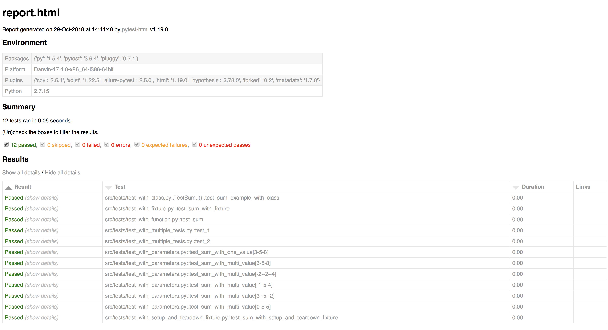
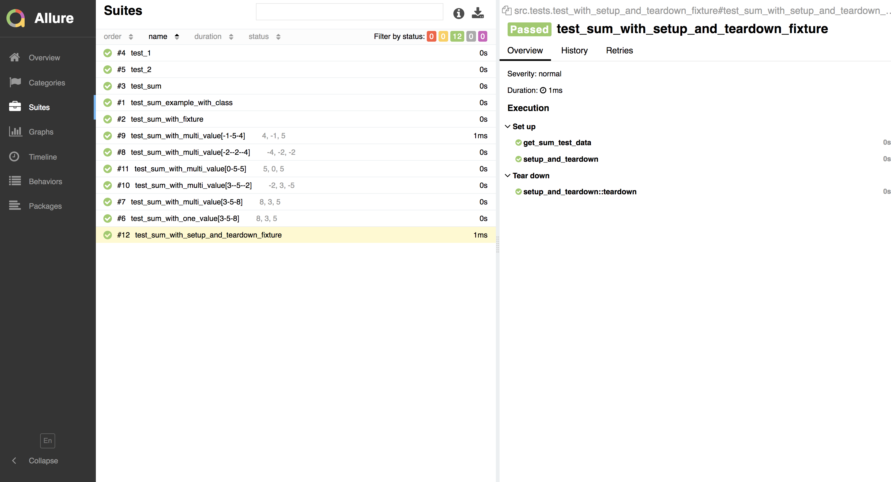
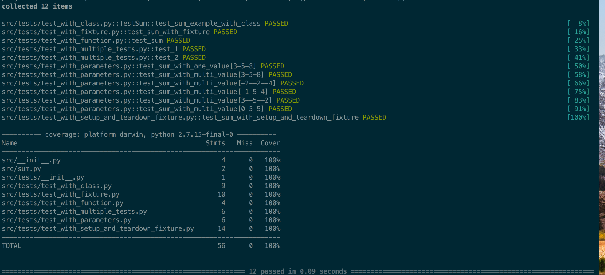

PYTEST TUTORIAL
=============
[](https://www.python.org/)
[](https://docs.pytest.org/en/latest/)
[](https://github.com/allure-framework/allure-python)
[](https://github.com/pytest-dev/pytest-html)
[](https://pypi.org/project/pytest-xdist/)
[](https://travis-ci.org/shashikumarraja/pytest_tutorial)
[](https://coveralls.io/github/shashikumarraja/pytest_tutorial?branch=master)
[](https://pyup.io/repos/github/shashikumarraja/pytest_tutorial/)
[](https://pyup.io/repos/github/shashikumarraja/pytest_tutorial/)


Contains pytest scripts which helps in understanding different pytest functionalities and features.

The [pytest](https://docs.pytest.org/en/latest/) framework makes it easy to write small tests, yet
scales to support complex functional testing for applications and libraries.

An example of a simple test:
```python
# content of test_sample.py
def inc(x):
    return x + 1
#make sure the test function's name starts with 'test_'
def test_answer():
    assert inc(3) == 5
```

How to Run the project?
=====
1. Clone/download this repo

2. Install all the dependencies using-
```shell
pip install -r requirements.txt
```

3. Tests are located inside `src/tests/`
```shell
pytest src/tests
```
4. To run tests and generate html report
```shell
pytest src/tests --html=report.html --self-contained-html
```



5. To run tests and generate allure report
```shell
#make sure report directory exists in the root folder
pytest src/tests --alluredir=report/

#To view the allure report
allure serve report/
```


6. To run tests with code coverage report
```shell
pytest --cov=src --verbose
```


7. To run tests with multiple cpu cycles(will speed up the test execution by running them in parallel)
```shell
pytest src/tests -n 5
```

8. To fix liniting errors the project uses [autopep8](https://github.com/hhatto/autopep8).
To modify a file in place (with aggressive level 2):
```shell
$ autopep8 --in-place --aggressive --aggressive <filename>
```